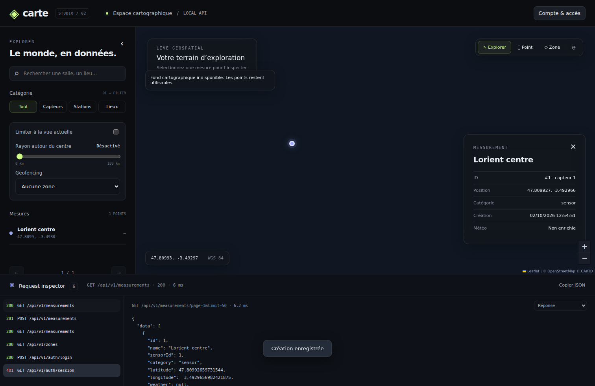

# Carte API · Geospatial Studio

Refonte TypeScript de l'application PHP historique de saisie de mesures et d'enrichissement météo. API authentifiée, explorateur Leaflet, stockage SQLite durable et import MySQL via export JSON.



## Démarrage local

Node.js **24.x**, npm et un disque local inscriptible sont requis. PHP, Composer et MySQL ne sont pas nécessaires pour la nouvelle application.

```sh
npm ci
cp .env.example .env
npm run build
```

Créez un compte; le mot de passe n'est pas transmis en argument de commande. Sur Bash :

```sh
read -rs -p 'Mot de passe (12 caractères minimum) : ' NEW_USER_PASSWORD
export NEW_USER_PASSWORD
npm run user:create -- gabin
unset NEW_USER_PASSWORD
npm start
```

Sur PowerShell :

```powershell
Copy-Item .env.example .env
$secret = Read-Host 'Mot de passe' -AsSecureString
$env:NEW_USER_PASSWORD = [System.Net.NetworkCredential]::new('', $secret).Password
npm run user:create -- gabin
Remove-Item Env:NEW_USER_PASSWORD
npm start
```

Ouvrez **http://localhost:3000/explorer**. La base démarre vide. Connectez-vous puis utilisez **+ Point**, cliquez sur la carte, renseignez le nom et envoyez le POST. Aucun jeu de données fictif n'est injecté en production. `npm run dev` active le rechargement du serveur; les assets Leaflet locaux sont préparés par `npm run build`.

Le mot de passe accepte au moins 12 caractères et au plus 72 octets (limite bcrypt). Les comptes créés ont tous les mêmes droits sur les mesures. Il n'y a pas de multitenancy ni de rôles administratifs dans cette version.

## Configuration

| Variable            | Valeur par défaut     | Utilisation                                                                      |
| ------------------- | --------------------- | -------------------------------------------------------------------------------- |
| NODE_ENV            | development           | development, test, production                                                    |
| PORT                | 3000                  | Port HTTP entre 1 et 65535                                                       |
| DATABASE_PATH       | data/carte.sqlite     | Fichier SQLite, parent créé si nécessaire                                        |
| PUBLIC_ORIGIN       | http://localhost:3000 | Origine exacte sans slash final; HTTPS en production                             |
| API_KEY             | vide                  | Clé machine Bearer; 32 caractères minimum si présente, obligatoire en production |
| OPENWEATHER_API_KEY | vide                  | Secret OpenWeather côté serveur; vide = mesure créée avec weather:null           |
| WEATHER_TIMEOUT_MS  | 4000                  | Timeout réseau de 100 à 15000 ms                                                 |
| CACHE_TTL_MS        | 30000                 | Cache des pages, de 0 à 60000 ms                                                 |
| TRUST_PROXY         | 0                     | Nombre de sauts proxy approuvés, de 0 à 5                                        |

Générez la clé machine avec `node -e "console.log(require('node:crypto').randomBytes(32).toString('hex'))"`, puis placez-la dans `.env`. Ne la commitez pas. L'ancienne clé publiée dans `insere.php` doit être révoquée chez OpenWeather: elle reste dans l'historique Git initial.

Le contrôle de débit et les sessions sont stockés dans SQLite. Les caches sont en mémoire: pages (256 entrées, TTL configurable) et météo (256 entrées, 5 minutes, clé arrondie à trois décimales). Une création invalide le cache des pages. Les requêtes météo simultanées identiques sont mutualisées; au-delà de 32 appels distincts en cours le service renvoie 503. Les réponses fournisseur sont bornées à 32 KiB, validées et soumises à timeout.

## Architecture

- `src/controllers/`: adaptation HTTP et DTO validés.
- `src/services/`: orchestration, météo, authentification et cache.
- `src/repositories/`: SQL paramétré, sessions, import transactionnel et données.
- `src/validators/`: schémas Zod stricts et vérification des polygones.
- `src/middleware/`: erreurs JSON, origine, CSRF, authentification et rate limiting.
- `public/`: interface JavaScript modulaire et CSS; aucune clé embarquée.
- `tests/`: tests des services, routes et migration.
- `e2e/`: parcours navigateur contre un serveur et une base éphémères.
- `docs/AUDIT.md`: constats sur le code initial et décisions de migration.

Une mesure et sa météo sont persistées atomiquement dans une même ligne. Les mesures conservent les noms de salle, ID de capteur (1–100), position et données météo; la catégorie est ajoutée. Un index géographique réduit les candidats de bbox et rayon. La distance Haversine est calculée dans SQLite. Les requêtes de recherche échappent les métacaractères LIKE. Le tri est déterministe (`id DESC`). La recherche LIKE SQLite est insensible à la casse ASCII; le pliage des caractères accentués n'est pas fourni.

## Contrat HTTP

Les lectures de données sont **authentifiées**. Toutes les requêtes d'écriture utilisent `Content-Type: application/json`, avec une limite de **32 KiB**. Les champs inconnus sont refusés. Les noms sont tronqués en espaces périphériques; les caractères de contrôle et balises sont rejetés, et les textes sont affichés via `textContent`.

| Méthode | Route                    | Accès                     | Résultat                                       |
| ------- | ------------------------ | ------------------------- | ---------------------------------------------- |
| GET     | /health                  | public                    | Liveness, `{ "status": "ok" }`                 |
| GET     | /ready                   | public                    | Contrôle SQLite, `{ "status": "ready" }`       |
| POST    | /api/v1/auth/login       | public, origine contrôlée | Cookie de session + jeton CSRF                 |
| GET     | /api/v1/auth/session     | session ou Bearer         | État d'accès, jeton CSRF pour session          |
| POST    | /api/v1/auth/logout      | session + CSRF, ou Bearer | 204 et invalidation du cookie                  |
| GET     | /api/v1/measurements     | session ou Bearer         | Liste paginée                                  |
| GET     | /api/v1/measurements/:id | session ou Bearer         | Mesure individuelle                            |
| POST    | /api/v1/measurements     | session + CSRF, ou Bearer | 201, header Location et mesure                 |
| GET     | /api/v1/zones            | session ou Bearer         | Zones paginées                                 |
| POST    | /api/v1/zones            | session + CSRF, ou Bearer | 201 et zone Polygon                            |
| GET     | /explorer                | public                    | Interface; données accessibles après connexion |

Les endpoints PHP historiques sont retirés, et leurs URLs renvoient 404. Il s'agit d'une migration majeure, sans compatibilité HTTP implicite.

### Authentification

```json
{ "username": "gabin", "password": "un-mot-de-passe-solide" }
```

`POST /api/v1/auth/login` crée un token aléatoire, stocké haché dans la base, expire après 8 heures et remplace la session précédente présentée par le navigateur. Cookie `HttpOnly; SameSite=Strict; Path=/`, `Secure` en production. Le JSON retourne `data.csrfToken`; envoyez ce jeton dans `X-CSRF-Token` pour toute écriture par session. Après rechargement, `/auth/session` restitue le jeton. Le mode machine utilise `Authorization: Bearer ...` et n'exige pas de CSRF. La clé est comparée en temps constant, n'est pas enregistrée par l'explorateur et donne les mêmes droits que les comptes. Un logout Bearer ne révoque pas la clé; sa rotation impose une modification d'environnement et un redémarrage.

120 requêtes API par minute et IP; 10 tentatives de connexion par 15 minutes et IP. 429 inclut `Retry-After`. Les compteurs expirent; aucune blacklist permanente. Ne définissez `TRUST_PROXY` que pour une topologie proxy maîtrisée, sinon un client pourrait falsifier son IP via les headers de forwarding. L'API n'autorise pas CORS; l'explorateur est servi sur la même origine.

### Créer une mesure

```json
{
  "name": "Salle Lorient",
  "sensorId": 1,
  "category": "sensor",
  "latitude": 47.75,
  "longitude": -3.36667
}
```

Le même endpoint accepte un GeoJSON Feature Point (attention: **longitude, latitude**):

```json
{
  "type": "Feature",
  "geometry": { "type": "Point", "coordinates": [-3.36667, 47.75] },
  "properties": { "name": "Salle Lorient", "sensorId": 1, "category": "sensor" }
}
```

La latitude est bornée à [-90, 90], la longitude à [-180, 180]. Catégories: `sensor`, `station`, `landmark`; `sensor` par défaut. Le nom contient 2 à 120 caractères. Si OpenWeather est configuré mais indisponible, aucun enregistrement n'est créé et une erreur 503 est retournée.

```json
{
  "data": {
    "id": 1,
    "name": "Salle Lorient",
    "sensorId": 1,
    "category": "sensor",
    "latitude": 47.75,
    "longitude": -3.36667,
    "weather": {
      "temperature": 12,
      "humidity": 70,
      "windSpeed": 3,
      "description": "ciel dégagé",
      "sunshine": "ensoleillé"
    },
    "createdAt": "2026-10-02T11:30:00.000Z"
  }
}
```

Les températures sont en °C, l'humidité en %, le vent en m/s. `weather` peut être `null`.

### Liste et pagination

`GET /api/v1/measurements?page=1&limit=50&search=Lorient&category=sensor`

- `page`: entier de 1 à 1000000, défaut 1.
- `limit`: entier de 1 à 200, défaut 50.
- `search`: nom de salle, 120 caractères maximum.
- `category`: une catégorie connue.
- `bbox`: `west,south,east,north`; coordonnées ordonnées; les rectangles traversant l'antiméridien doivent être divisés en deux appels.
- `latitude`, `longitude`, `radiusKm`: ensemble obligatoire; rayon >0 et ≤500 km.

Tous les filtres sont combinés par AND. Une page au-delà de la fin renvoie une liste vide.

```json
{ "data": [], "pagination": { "page": 1, "limit": 50, "total": 0, "pages": 0 } }
```

Exemple machine après configuration d'API_KEY dans l'environnement du terminal:

```sh
curl -H "Authorization: Bearer $API_KEY" 'http://localhost:3000/api/v1/measurements?latitude=47.75&longitude=-3.36&radiusKm=10&limit=50'
curl -X POST -H "Authorization: Bearer $API_KEY" -H 'Content-Type: application/json' --data '{"name":"Salle Lorient","sensorId":1,"latitude":47.75,"longitude":-3.36}' http://localhost:3000/api/v1/measurements
```

### Zones

```json
{
  "name": "Zone Lorient",
  "geometry": {
    "type": "Polygon",
    "coordinates": [
      [
        [-3.4, 47.7],
        [-3.3, 47.7],
        [-3.3, 47.8],
        [-3.4, 47.7]
      ]
    ]
  }
}
```

Un seul anneau extérieur est supporté, sans trous, avec 4 à 500 positions, fermeture exacte, trois sommets distincts minimum et aire non nulle. Les arêtes qui se croisent et celles traversant l'antiméridien sont refusées. Il ne s'agit pas d'un moteur SIG général.

Le filtre de zone dans l'explorateur combine une bbox serveur et un test point-dans-polygone **sur la page courante**. Le compteur affiche le nombre dans cette page et le total dans l'emprise; ce n'est pas un total global exact du polygone. Les zones peuvent être chargées par pages de 200. Les clusters agrègent les points de la page affichée uniquement. Les outils permettent d'éditer, copier et envoyer le payload JSON; les requêtes POST ne partent qu'après clic explicite.

### Erreurs

```json
{
  "error": {
    "code": "VALIDATION_ERROR",
    "message": "Données invalides",
    "details": [
      { "path": "latitude", "message": "Too big: expected number to be <=90" }
    ],
    "requestId": "67d5c0af-16de-4c35-84b8-6e06f1bc69a0"
  }
}
```

400: validation ou JSON invalide; 401: authentification; 403: origine ou CSRF; 404: ressource; 413: corps trop volumineux; 415: format; 429: débit; 503: fournisseur météo indisponible/occupé; 500: erreur interne. Aucune stack ou erreur SQL ne sort dans la réponse. `X-Request-ID` corrèle les réponses avec les logs JSON; les logs ne contiennent ni mots de passe, ni clé, ni cookies, ni query string.

## Migration depuis MySQL

1. Révoquez la clé météo historique et sauvegardez la base source. Travaillez d'abord sur un export de test.
2. Exportez les tables `mesure`, `meteo`, `users` en un objet JSON avec les trois tableaux ci-dessous. L'ancien dépôt ne fournit aucun DDL: confirmez que la clé primaire est `mesure.id` et adaptez l'export si nécessaire. N'exportez pas `tip` ni `tblacklist`.
3. Normalisez les dates de l'export en UTC avec suffixe Z. Une date sans fuseau est interprétée comme UTC par l'import, **pas** comme l'heure locale française. Les dates absentes deviennent la date d'import.
4. Lancez l'import sur une base cible neuve, avant de créer les nouveaux utilisateurs.

```json
{
  "mesure": [
    {
      "id": 42,
      "salle": "Salle A",
      "identificateur": 1,
      "latitude": 47.75,
      "longitude": -3.36,
      "date": "2025-01-01T12:00:00Z"
    }
  ],
  "meteo": [
    {
      "fkid": 42,
      "temperature": 12,
      "tps": "clair",
      "ensoleillement": "ensoleillé",
      "humidite": 70,
      "vitessevent": 2
    }
  ],
  "users": []
}
```

```sh
npm run import:legacy -- export.json
```

Les champs supplémentaires historiques dans chaque ligne sont tolérés, mais les propriétés de l'objet racine sont strictes. Les IDs des mesures sont conservés. La jointure utilise `fkid` et les mesures sans météo restent valides. Les doublons de clé source, météo orpheline ou multiple, coordonnées invalides et dates invalides bloquent l'import. Les insertions et comptes sont dans une seule transaction: aucune importation partielle.

Les comptes doivent contenir `userid` et `pwd` avec un hash bcrypt PHP `$2y$` (ou `$2a$`/`$2b$`). Les hashes Argon2 ou autres sont refusés: retirez les comptes de l'export et recréez-les via une réinitialisation. Aucune donnée distante n'est automatiquement modifiée. L'import est refusé si les tables cibles measurements ou users contiennent déjà des données.

## Interface et dépendances cartographiques

Leaflet 1.9 et MarkerCluster sont installés via npm et copiés dans `public/vendor` au build. CSS, scripts et polices système sont locaux. Le fond sombre utilise les **tuiles raster CARTO / OpenStreetMap**, pas des tuiles vectorielles. Leur accès réseau et leurs conditions d'utilisation restent nécessaires; pour une utilisation industrielle, choisir un fournisseur adapté au trafic ou un hébergement de tuiles dédié. La carte conserve les points et affiche une notification quand le fond est inaccessible. Géolocalisation et copie dépendent des permissions navigateur et du contexte sécurisé (HTTPS ou localhost).

Le dock HTTP affiche les 50 dernières requêtes, les statuts, latences observées et JSON. Les payloads de connexion et jetons CSRF sont masqués. Les données restent en mémoire dans la page; aucune clé ne va en localStorage. La recherche est debouncée à 280 ms et les requêtes précédentes sont annulées.

## Qualité et CI

```sh
npm run lint
npm run format:check
npm run build
npm test
npx playwright install --with-deps chromium
npm run test:e2e
npm audit --omit=dev --audit-level=high
```

42 tests unitaires/intégration passent; le parcours Playwright vérifie connexion, POST Point, POST Polygon, inspector, recherche, mobile, panneau et logout. Les tests backend n'appellent aucun fournisseur réel. Le serveur E2E dispose de sa propre base en mémoire et d'un compte réservé au test; il ne touche pas la base utilisateur. Les captures dans docs sont générées avec une mesure de test.

La CI exécute les mêmes contrôles sur Node 24 pour les push et pull requests, avec permission contents:read. Pour mettre à jour les dépendances: effectuer l'audit complet, vérifier les versions supportées, réexécuter toute la suite et commiter le lockfile.

## Déploiement et exploitation

```sh
docker build -t carte-api:2 .
docker run --rm -p 3000:3000 --env-file .env -v carte-data:/app/data carte-api:2
```

En production, mettez `NODE_ENV=production`, une clé machine aléatoire et `PUBLIC_ORIGIN=https://votre-domaine` (votre origine réelle) dans l'environnement. Placez un reverse proxy HTTPS devant le conteneur et restreignez l'accès direct au port 3000. Initialisez les comptes avant le déploiement avec la CLI locale sur la base montée, ou utilisez la clé API dans l'explorateur. Le conteneur fonctionne comme utilisateur `node`; le volume doit lui être inscriptible. Le dossier de données ne doit jamais être servi par le serveur HTTP.

SQLite WAL doit être stocké sur **un disque local persistant**, pas un montage réseau. Cette architecture cible **une seule instance sur une seule machine**. SQLite synchrone et COUNT/Haversine ne remplacent pas un index spatial PostGIS: la latence dépend du volume et de la sélectivité des filtres. Avant des charges élevées ou plusieurs machines, migrer les repositories vers PostgreSQL/PostGIS, les sessions et limites vers Redis, puis mesurer la charge. Aucun résultat de benchmark de production n'est revendiqué.

Pour sauvegarder, utilisez l'API backup de SQLite ou arrêtez proprement le serveur avant de copier le fichier; ne copiez pas seulement le .sqlite pendant une écriture WAL active. Testez une restauration avant migration. `/health` vérifie le processus, `/ready` la base. SIGTERM/SIGINT arrête le serveur proprement (10 secondes maximum). Le timeout requête est de 15 secondes. Les erreurs fournisseur n'enregistrent aucune mesure incomplète. Prévoyez supervision des 5xx/429, espace disque et latence fournisseur.

## Livraison Git

Les changements sont sur `refactor/production-api-explorer`, avec neuf commits Conventional Commits. Consultez `docs/COMMITS.md` pour les messages exacts et fichiers de chaque étape. La livraison fournit aussi le code intégral des fichiers créés/modifiés à chaque commit et une archive source. Le dépôt Git distant et la base de production n'ont pas été modifiés. Aucun secret ni fichier .env n'est inclus dans l'archive source.
